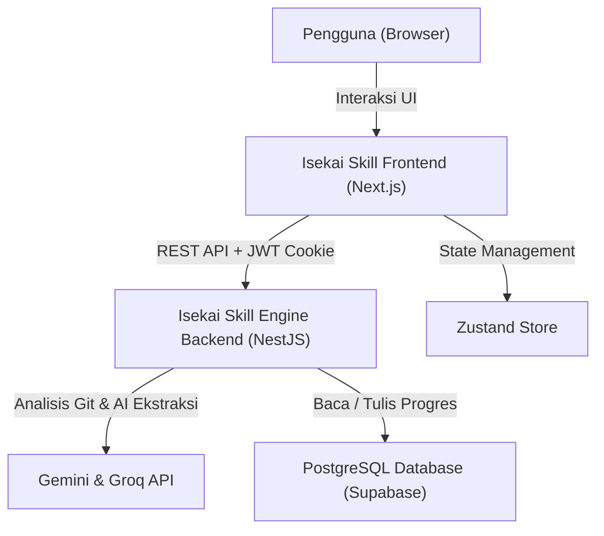

# 🖥️ Isekai Skill Frontend

[](https://nextjs.org/)
[](https://www.typescriptlang.org/)
[](https://tailwindcss.com/)
[](https://zustand-demo.pmnd.rs/)

**Isekai Skill Frontend** adalah antarmuka web utama sistem Aether — dasbor bergaya RPG yang memungkinkan pengguna melacak kemajuan belajar, mengunggah bukti pembelajaran, dan mengikuti kuis adaptif berbasis AI. Proyek ini berpasangan langsung dengan repositori backend:

🔗 **[isekai-skill-engine-backend](https://github.com/faizulmushofa/isekai-skill-engine-backend)**

Semua data progres skill, XP, dan riwayat aktivitas ditarik secara real-time dari backend melalui REST API yang aman berbasis JWT + HttpOnly Cookie.

---

## 🏗️ Arsitektur Hubungan Sistem

Berikut adalah alur integrasi antara klien dan layanan backend Isekai Skill Engine:



---

## ⚡ Fitur Utama

- 🗺️ **Skill Tree & Konstelasi**: Visualisasi jalur belajar sebagai pohon keahlian hierarkis dan konstelasi dinamis berbasis progres nyata dari Bayesian Engine.
- 📝 **Learning Journal**: Tulis atau unggah jurnal belajar (PDF/TXT) — AI secara otomatis mengekstrak skill yang dipelajari dan mengakumulasi XP ke profil pengguna.
- 🐙 **Project Evidence Tracker**: Hubungkan repositori GitHub untuk dianalisis perubahan kode-nya — setiap commit dideteksi sebagai bukti keahlian teknikal.
- 🧠 **AI Quiz Arena**: Sesi kuis adaptif yang dibangkitkan secara dinamis oleh AI berdasarkan topik skill aktif dan tingkat progres XP pengguna.
- 📊 **Riwayat Kuis & XP**: Panel riwayat pengerjaan kuis lengkap dengan skor, tanggal, topik, dan perolehan XP per skill.
- 🏆 **Dashboard Progres**: Tampilan kartu progres karir dan skill secara keseluruhan dengan animasi XP yang responsif.
- 🔐 **Autentikasi Aman**: Manajemen sesi menggunakan JWT Access Token (in-memory) + Refresh Token (HttpOnly Cookie) tanpa penyimpanan token di `localStorage`.

---

## ⚙️ Variabel Lingkungan (`.env.local`)

Buat file `.env.local` di root proyek dan isikan variabel berikut:

| Environment Variable | Default | Deskripsi |
| :--- | :--- | :--- |
| `NEXT_PUBLIC_API_URL` | *Wajib Diisi* | URL base backend NestJS. Contoh: `http://localhost:3090` |
| `PORT` | `3000` | Port server development Next.js. |

---

## 📁 Struktur Proyek

```text
/
├── app/                    # Next.js App Router — Halaman & Layout
│   ├── dashboard/          # Halaman dashboard utama progres skill
│   ├── journals/           # Halaman Learning Journal (tulis & upload)
│   ├── projects/           # Halaman Project Evidence Tracker
│   ├── quiz/               # Halaman AI Quiz Arena & riwayat kuis
│   ├── skills/             # Halaman Skill Tree & konstelasi
│   └── login/              # Halaman autentikasi
├── components/             # Komponen UI yang dapat digunakan ulang
│   ├── dashboard/          # Komponen widget dashboard
│   ├── journal/            # Komponen editor & viewer jurnal
│   ├── project/            # Komponen penghubung proyek Git
│   ├── quiz/               # Komponen Quiz Arena & riwayat
│   └── ui/                 # Elemen UI inti (Button, Card, Input, dll.)
├── hooks/                  # Custom React Hooks (useJournals, useProjects, dll.)
├── lib/                    # Utilitas & konfigurasi klien API (Axios)
├── stores/                 # Manajemen state global Zustand
└── public/                 # Aset statis (gambar, ikon, logo)
```

---

## 🛠️ Langkah Menjalankan Secara Lokal (Development)

### Prasyarat
- Node.js v20 atau versi yang lebih baru
- Backend Isekai Skill Engine berjalan di `http://localhost:3090`

### 1. Clone & Install Dependensi
```bash
git clone https://github.com/faizulmushofa/isekai-skill-front-end.git
cd isekai-skill-front-end
npm install
```

### 2. Konfigurasi Environment
```bash
cp .env.local.example .env.local
# Edit .env.local dan isi NEXT_PUBLIC_API_URL dengan URL backend
```

### 3. Jalankan Aplikasi Secara Lokal
```bash
npm run dev
```

Aplikasi akan berjalan di `http://localhost:3000`.

### 4. Build Produksi (Opsional)
```bash
npm run build
npm run start
```

---

## 📜 Ringkasan Halaman & Alur Pengguna

### 🔑 Autentikasi
* `POST /auth/register` → Daftar akun → Verifikasi OTP email.
* `POST /auth/login` → Login → Redirect ke `/dashboard`.

### 📊 Dashboard
* Menampilkan progres karir aktif, distribusi skill, dan ringkasan aktivitas terkini.

### 📝 Journals
* Tulis jurnal teks atau upload file PDF/TXT.
* Setelah tersimpan, AI mengekstrak skill secara otomatis — XP langsung tercatat.
* Tombol **"Lihat / Muat Ulang XP"** menampilkan perolehan skill dari setiap jurnal.

### 🐙 Projects
* Daftarkan URL repositori GitHub → Backend melakukan analisis git diff.
* Tombol **"Orchestrate"** memicu scanning AI dan kalkulasi XP coding.

### 🧠 Quiz
* Mulai kuis berdasarkan topik skill aktif.
* Setiap jawaban dievaluasi AI → XP diberikan secara otomatis.
* Panel **"Riwayat Ujian"** menampilkan semua sesi kuis beserta perolehan XP.

---

## 🧑‍💻 Penulis
* **Faizul Mushofa** - [faizulmushofa](https://github.com/faizulmushofa)
